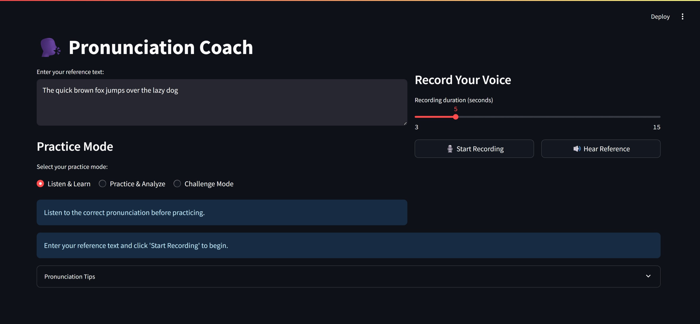

# 🗣️ Speech Pronunciation Checker

A Streamlit web app that lets users record their speech, detects mispronounced words, and provides correct pronunciation feedback using Google Text-to-Speech (gTTS).



---

## 🚀 Features

- 🎤 Record your voice directly from the browser
- 🧠 Automatic speech recognition using `SpeechRecognition`
- ❌ Detect and highlight mispronounced words
- 🔊 Get correct pronunciation using Google TTS
- 💻 Lightweight, runs in browser with Streamlit

---

## 📦 Installation

Clone this repository:

```bash
git clone https://github.com/ngoyal88/pronunciation-checker.git
cd pronunciation-checker
```
Install all required dependencies:
```bash
pip install -r requirements.txt
```

▶️ Run the App
To start the application, run:
```bash
streamlit run app.py
```
Once the server starts, a browser window will open showing the app.